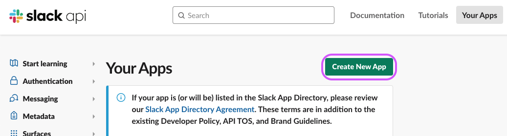
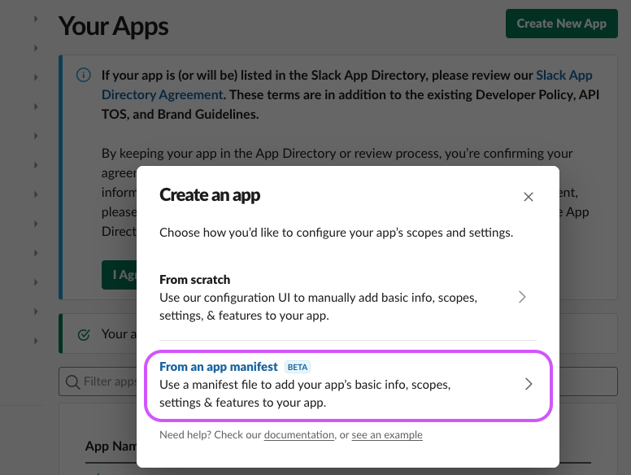
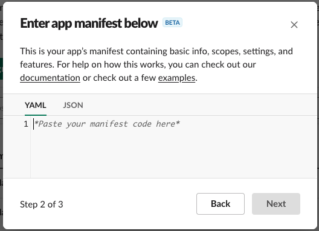
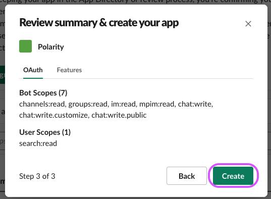
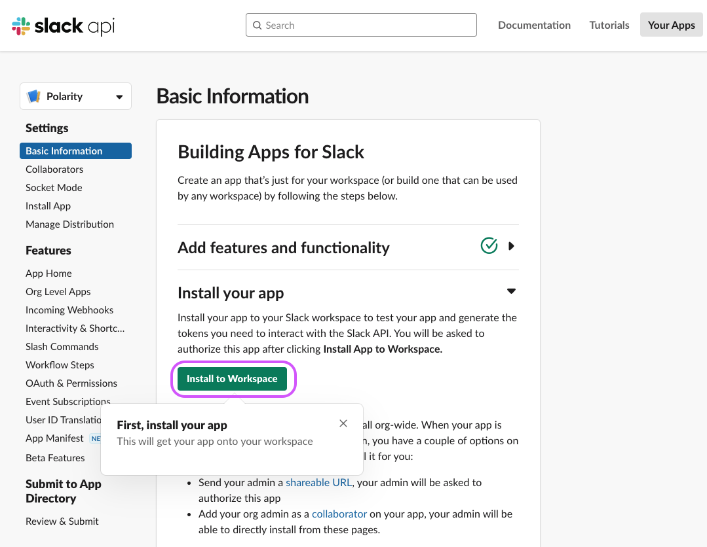
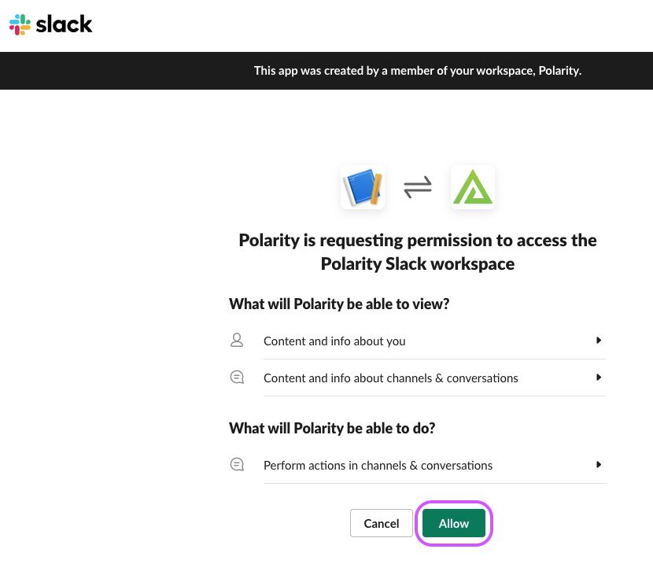
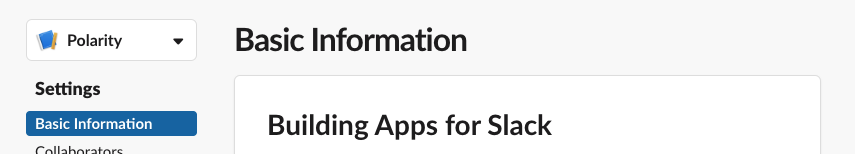
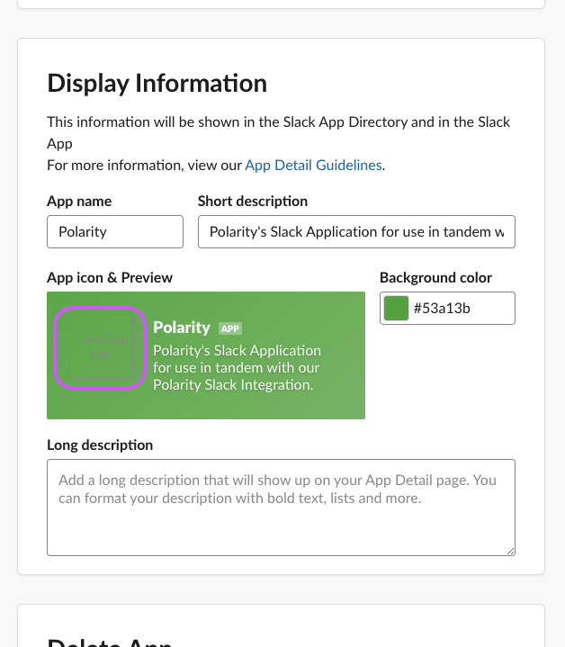
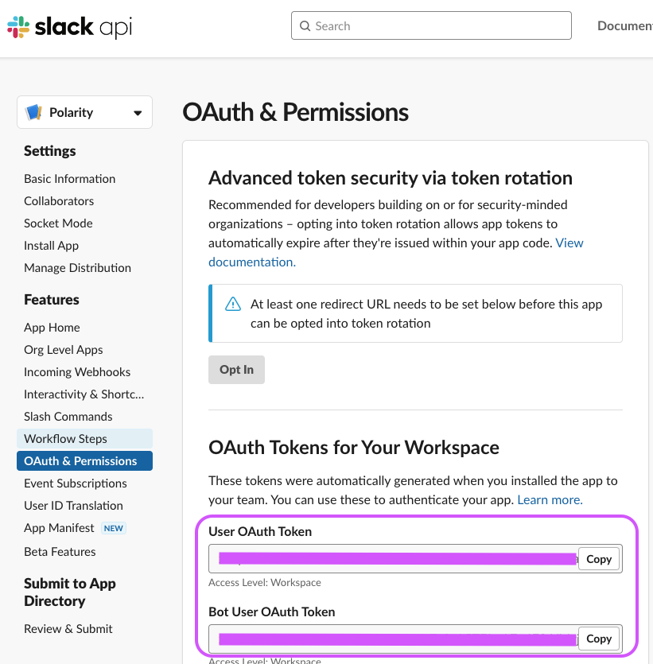

# Create Polarity Slack App

1. Go to https://api.slack.com/apps/
2. Click on `Create New App` 
    <div>
      
    </div>

3. Select `From an app manifest`
    <div>
      
    </div>

4. Select your workspace you would like the integration to run on via the dropdown, then Click `Next`
    <div>
      
    </div>

5. Delete the contents of the YAML App Manifest
    <div>
      
    </div>

6. Paste in ***this*** App Manifest in the empty input, then Click `Next`:
    ```yaml
    display_information:
      name: Polarity
      description: Polarity's Slack Application for use in tandem with our Polarity Slack Integration.
      background_color: "#53a13b"
    features:
      app_home:
        home_tab_enabled: false
        messages_tab_enabled: false
        messages_tab_read_only_enabled: false
      bot_user:
        display_name: Polarity
        always_online: true
    oauth_config:
      scopes:
        user:
          - search:read
        bot:
          - channels:read
          - groups:read
          - im:read
          - mpim:read
          - chat:write
          - chat:write.customize
          - chat:write.public
          - users:read
          - users.profile:read

    settings:
      org_deploy_enabled: false
      socket_mode_enabled: false
      token_rotation_enabled: false
    ```

7. Click `Create`
    <div>
      
    </div>

8. On the `Polarity` Slack app page it brings you to, click `Install to Workspace`
    <div>
      
    </div>

9. Click `Allow`
    > ***NOTE:*** The user that clicks allow will determine which private channels can be searched. Creating a new user with access to the private channels you want to search and clicking `Allow` while logged into this user is recommended.
    <div>
      
    </div>

10. Download the image found here: https://github.com/polarityio/slack/raw/develop/assets/app-profile-picture.png
    <div>
      
    </div>
    
11. On the `Basic Information` tab
    <div>
      
    </div>
- Scroll down to the `Display Information` section, click `+ Add App Icon`, and select the image from `Step 10`.
    <div>
      
    </div>

12.  Now you `User Token` and `Bot Token` can be found on the `OAuth & Permissions` tab
    <div>
      
    </div>
