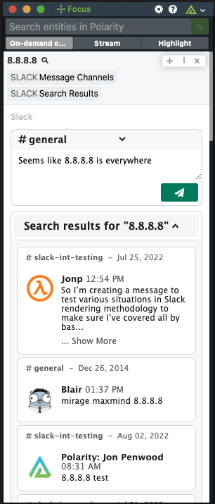
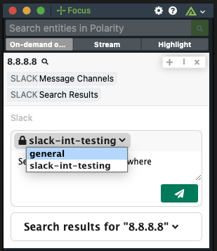

# Polarity Slack Integration

The Polarity Slack Integration allows you to ***Send Messages to Channels in Slack*** directly from the Overlay , and ***Search Entities in Slack Channel Messages*** for all entity types.

> ***NOTE:*** Instead of `npm install` it would be best to run `npm install --production`.
> ***NOTE:*** You must go through the process of creating your `Polarity Slack App` in your Slack instance.  Instructions on how to do this can be found in the [**Polarity App Installation Guide**](./AddSlackAppToWorkspace.md).

  
  

To learn more about Slack, visit the [official website](https://slack.com/).

## Private Channels
- ***Searching:*** To search private channels, make sure the user that clicked `Allow` in `Step 9` in the [**Polarity App Installation Guide**](./AddSlackAppToWorkspace.md) is in that private channel you want to search.
- ***Messaging:*** To allow messaging in private channels, you must first send a `@Polarity` message in the private channel, and invite the app to the channel.

## Polarity Slack Command
- To Enable to `/polarity` Slack Command follow the instructions found in the [**Polarity Slack Command Setup Guide**](./SetupSlackCommand.md).
- > ***NOTE:*** The Slack Command will return only some, and not necessarily all, of the Overlay Summary Tags for the Integrations you are Subscribed to in the Polarity Slack App Home (_See [**Polarity Slack Command Setup Guide**](./SetupSlackCommand.md) Step 8 for reference_).  This is to be expected with the current version of the app.  If you find an Integration isn't returning Summary Tags and you would like it to in the future, please reach out to `support@polarity.io` about which Integration you would like to be supported by the `/polarity` Slack Command.

## Slack Integration Options
### Slack API URL
The URL of the Slack API you would like to connect to.  

### User Token
The API User Token associated with the your Polarity Slack App. Your User Token should start with "xoxp-###...". Optional if you don't wish to search.

### Bot Token
The API Bot Token associated with the your Polarity Slack App. Your User Token should start with "xoxb-###...". 

### Ignore Entity Types
When checked, strings searched that are one of our predefined entity types (IPv4, IPv6, IPv4CIDR, MD5, SHA1, SHA256, MAC, string, email, domain, url, and cve) will not be displayed in the overlay.

> ***NOTE:*** By default commented out in the `./config/config.js` file.
### Minimum Input Length
The minimum text input length for a string to be considered Input. (default: 5)

### Maximum Input Length
The maximum text input length for a string to be considered Input. (default: 256)

### Allow Searching Slack Messages
If checked, all entities will be search in Slack.
> ***NOTE:*** This option must be set to "Users can view only" or "Users can view and edit"

### Sort Message Search Results By
Return the search results in a particular order.  Options are `Best Search Match First`, `Most Recent Search Match First`, and `Oldest Search Match First`

### Allow Sending Slack Messages
If checked, a prompt will show for every entity searched, regardless of Search Results, allowing you to send a message to any Channels listed below.
> ***NOTE:*** This option must be set to "Users can view only" or "Users can view and edit"

### Slack Channel Names for Messages
A comma separated list of Channels Names anyone using the Integration can send a messages to. If you want to send messages to a private channel, you must send a message in the channel containing "@Polarity" in it first.

### Slack Messaging Display Name
The name you wish to use when Posting Messages on Slack Channels.  If left empty the default display name will just be "Polarity".

### Add Entity Value to Message By Default
If checked, the entity value will be added to the Slack Messaging Box in the Overlay by Default

## Installation Instructions

Installation instructions for integrations are provided on the [PolarityIO GitHub Page](https://polarityio.github.io/).

## Polarity

Polarity is a memory-augmentation platform that improves and accelerates analyst decision making.  For more information about the Polarity platform please see:

https://polarity.io/
