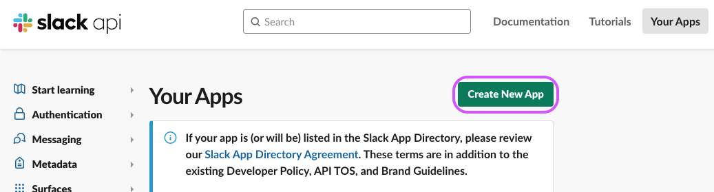
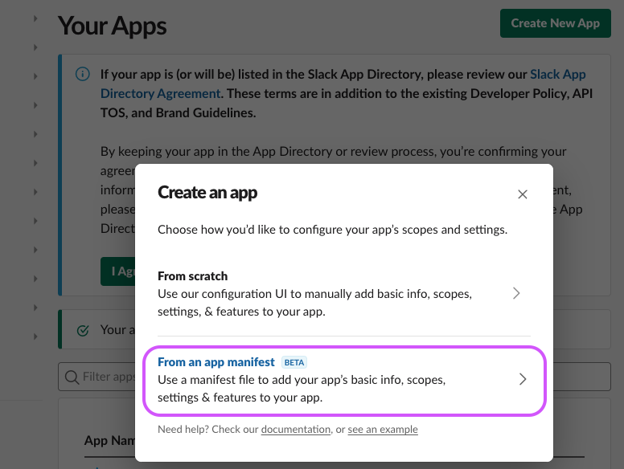
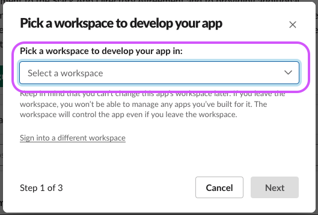
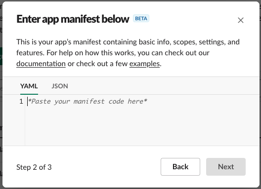
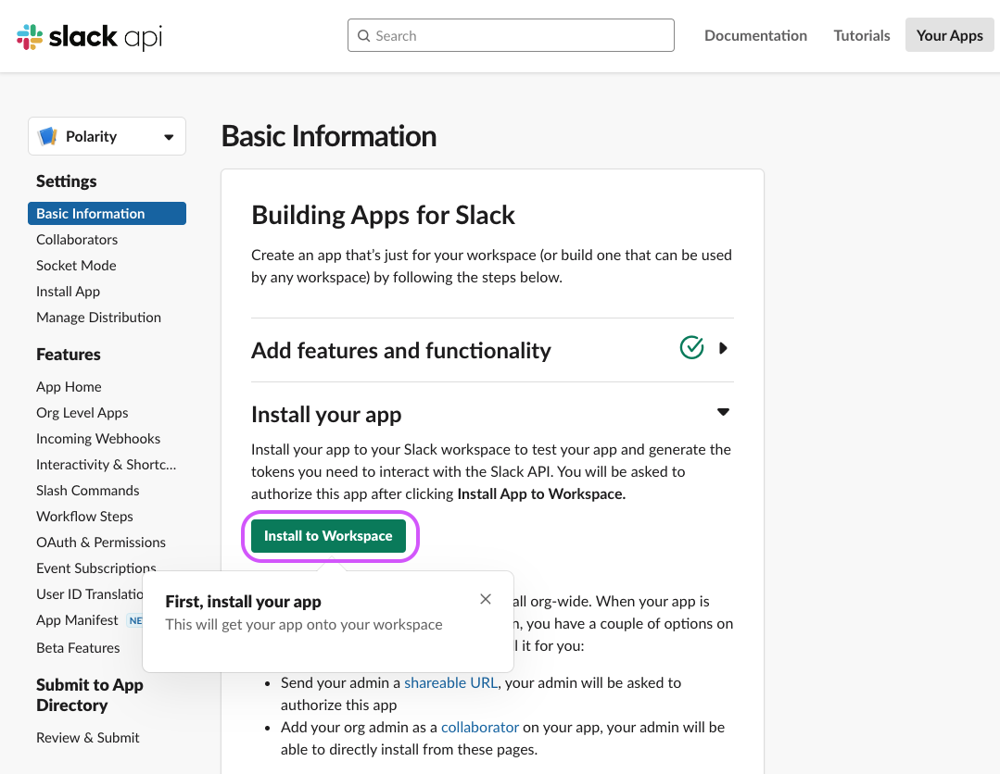

# Polarity Slack Integration

The Polarity Slack Integration allows you to ***Send Messages to Channels in Slack*** directly from the Overlay, and ***Search Entities in Slack Channel Messages*** for all entity types.

> ***NOTE:*** If you are repeatedly getting `Rate Limit Exceeded - You might have too many Slack Channels or too many messages in the channels.` you might need reduce the channels your credentials have access to search in the Slack Credentials dashboard.

<div style="display:flex; justify-content:center; align-items: flex-start;">
  
  
</div>

To learn more about Slack, visit the [official website](https://slack.com/).

## Setting up a Polarity App in Slack

To obtain the required User and Bot authentication tokens required by the Polarity-Slack integration you must create a new Polarity Slack App by following the below instructions. 

1. Go to https://api.slack.com/apps/
2. Click on `Create New App`
    <div>
      
    </div>

3. Select `From an app manifest`
    <div>
      
    </div>

4. Select your workspace you would like the integration to run on via the dropdown, then Click `Next`
    <div>
      
    </div>

5. Delete the contents of the YAML App Manifest
    <div>
      
    </div>

6. Paste in ***this*** App Manifest in the empty input, then Click `Next`:
    ```yaml
    display_information:
      name: Polarity
      description: Polarity's Slack Application for use in tandem with our Polarity Slack Integration.
      background_color: "#53a13b"
    features:
      app_home:
        home_tab_enabled: false
        messages_tab_enabled: false
        messages_tab_read_only_enabled: false
      bot_user:
        display_name: Polarity
        always_online: true
    oauth_config:
      scopes:
        user:
          - search:read
        bot:
          - channels:read
          - groups:read
          - im:read
          - mpim:read
          - chat:write
          - chat:write.customize
          - chat:write.public
          - users:read
          - users.profile:read

    settings:
      org_deploy_enabled: false
      socket_mode_enabled: false
      token_rotation_enabled: false
    ```
> See "Polarity Slack Integration Permissions" for more information on the scopes used by the integration.  Depending on which integration capabilities you use, not all scopes are required. 

7. Click `Create`
    <div>
      
    </div>

8. On the `Polarity` Slack app page it brings you to, click `Install to Workspace`
    <div>
      
    </div>

9. Click `Allow`
   > ***NOTE:*** The user that clicks allow will determine which private channels can be searched. Creating a new user with access to the private channels you want to search and clicking `Allow` while logged into this user is recommended.
    <div>
      
    </div>

10. Download the image found here: https://github.com/polarityio/slack/raw/develop/assets/app-profile-picture.png
    <div>
      
    </div>

11. On the `Basic Information` tab
    <div>
      
    </div>
- Scroll down to the `Display Information` section, click `+ Add App Icon`, and select the image from `Step 10`.
    <div>
      
    </div>

12.  Now you `User Token` and `Bot Token` can be found on the `OAuth & Permissions` tab
     <div>
     
     </div>

## Polarity Slack Integration Permissions

The Polarity Slack integration supports searching Slack as well as allowing users to send messages from the Overlay Window. The following permissions are required for full functionality:


| Permission                    | Scope | Use | Description                                                                   |
|-------------------------------|--------|--------|-------------------------------------------------------------------------------|
| search:read                   | user | search | Searching Slack messages                                                      |
| channels:read<br/>groups:read | bot | search | Listing channels in Slack (in the Slack API groups refer to private channels) 
| users:read                    | bot | search | Listing users in Slack |
| chat: write | bot | send |   Sending messages to channels |
| chat:write.public | bot | send | Optionally required for sending messages to public channels the bot is not explicitly invited into. |
| chat:write.customize | bot | send | Optionally required for customizing name of Polarity bot when sending messages |

Permissions marked as “search” are required if you want the integration to be able to search Slack channels. Permissions marked as “send”, are required if you want the integration to be able to send messages to a Slack channel.

For additional information on which scopes are required for which capabilities please see below.

### Searching Slack
If you would like the Polarity Slack integration to have the ability to search conversations within Slack you will need to provide the permissions listed below.

#### User Token Scopes
The search capability relies on the search.messages API endpoint which requires the search:read permissions scope. This scope is only available as a user token scope.

```
search:read
```
For more information on the `search.messages` API endpoint see: https://api.slack.com/methods/search.messages

> Since the search:read permission is a user scope, when running searches within Slack, the integration will have access to the same channels as the user that authorized the application.

#### Bot Token Scopes
In addition to the general search capability provided by the user token `search:read` permission, the integration requires the ability to list channels in a Slack team. This capability uses the `conversations.list` endpoint and requires the following bot token scopes:

```
channels:read
groups:read
```
For more information on the `conversations.list` API endpoint see https://api.slack.com/methods/conversations.list

In addition to listing channels, the integration needs to be able to list users and view user profile information (e.g., to display the user avatar). The users.list API endpoint is used for this and requires the following bot token scope:

```
users:read
```
For more information on the `users.list` API endpoint see https://api.slack.com/methods/users.list

### Sending Slack Messages

In addition to searching a Slack Team space, the integration supports sending messages to channels from the Polarity Overlay Window. This capability can be enabled by toggling on the “Allow Sending Slack Messages” integration option. All permissions required for sending messages are Bot Token Scopes.

#### Bot Token Scopes

If sending messages is enabled, the integration uses the `chat.postMessage` API endpoint to send messages and requires the `chat:write` bot token scope:

```
chat:write
```

For more information on `chat.postMessage` API endpoint see https://api.slack.com/methods/chat.postMessage


By default, you can only send messages to channels that the Polarity bot is invited to. If you would like the bot to be able to send messages to any public channel, you must add the `chat:write.public` bot scope. If this permission is not provided, the bot must be invited to all channels you would like to be able to send messages to.

```
chat:write.public
```
By default, the bot will post with the name “Polarity”. If you would like to change the name using the “Slack Messaging Display Name” integration option, you must also include the `chat:write.customize` option:

```
chat:write.customize
```

This permission is required if you want to change the name that the Polarity bot posts as. See the "Slack Messaging Display Name" option.


## Private Channels

###  Searching Private Channels

To search private channels, make sure the user that clicked `Allow` in `Step 9` of the "Setting up a Polarity App in Slack" guide is in that private channel you want to search.

### Sending Messages to Private Channels 

To allow messaging in private channels, you must first send a `@Polarity` message in the private channel, and invite the app to the channel.

## Slack Integration Options

### Slack API URL
The URL of the Slack API you would like to connect to.  

### User Token
The API User Token associated with your Polarity Slack App. Your User Token should start with "xoxp-###...". Optional if you don't wish to search.

### Bot Token
The API Bot Token associated with your Polarity Slack App. Your User Token should start with "xoxb-###...". 

### Allow Searching Slack Messages
If checked, the integration will search and return Slack messages that match enabled entity values.

### Sort Message Search Results By
Return the search results in a particular order.  Options are `Best Search Match First`, `Most Recent Search Match First`, and `Oldest Search Match First`

### Allow Sending Slack Messages
If checked, a prompt will show for every entity searched, regardless of Search Results, allowing you to send a message to any Channels listed below.

> This option must be set to "Lock and show option for all users".

### Slack Channel Names for Messages
A comma separated list of Channels Names anyone using the Integration can send a messages to. If you want to send messages to a private channel, you must send a message in the channel containing "@Polarity" in it first.

> This option must be set to "Lock and show option for all users".

### Slack Messaging Display Name
The name you wish to use when Posting Messages on Slack Channels.  If left empty the default display name will just be "Polarity".

### Add Entity Value to Message By Default
If checked, the entity value will be added to the Slack Messaging Box in the Overlay by Default

> This option must be set to "Lock and show option for all users".

## Installation Instructions

Installation instructions for integrations are provided on the [PolarityIO GitHub Page](https://polarityio.github.io/).


## Polarity

Polarity is a memory-augmentation platform that improves and accelerates analyst decision making.  For more information about the Polarity platform please see:

https://polarity.io/
