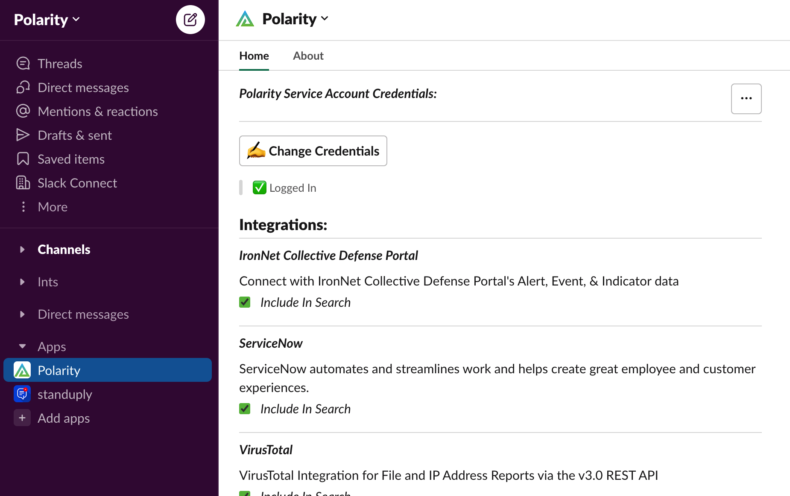

# Polarity Slack Command Setup Guide

1. Go to the [./config/config.js](./config/config.js) file, and change the `slackCommandServer`'s `portNumber` & `polarityUrl`properties to your Polarity Server's information, making sure the `portNumber` you have set has been exposed from the polarity server.
    > ***NOTE***: Ensure your `polarityUrl` property does not end with `/`


2. In the terminal run `npm run createEnvFile`, then Set the `.env` variable `POLARITY_SLACK_APP_BOT_TOKEN` to your Slack Bot Token (_from the [Polarity App Installation Guide](./AddSlackAppToWorkspace.md) Step 12_) inside of the generated `./slack-command/.env` file.
    > ***NOTE***: The `npm run createEnvFile` script will open the file in `vi`

    > ***NOTE***: For local development and testing, or for the `npm run updateAppManifest` command, it would also be beneficial to set your `POLARITY_SLACK_APP_TOKEN` & `POLARITY_SLACK_APP_REFRESH_TOKEN` as well, which can be found/generated [HERE](https://api.slack.com/authentication/config-tokens) by Authorized Slack App Collaborators in Slack.
   <div>
      
      
    </div>
   
> ***NOTE***: _Steps 3-5_ can be skipped if you have your  `POLARITY_SLACK_APP_TOKEN` & `POLARITY_SLACK_APP_REFRESH_TOKEN` `.env` variables set, and instead of _Steps 3-5_  you can just run `npm run updateAppManifest` in the terminal

3. Go to https://api.slack.com/apps/ and select the `Polarity` App

4. Navigate to the App Manifest Page, and Delete the contents of the YAML App Manifest
    <div>
      
    </div>

5. Paste in ***this*** App Manifest, ensuring to replace the 3 instances of `<your-polarity-server>:<exposed-port>` with your servers information, then Click `Save Changes`:
    ```yaml
    display_information:
      name: Polarity
      description: Polarity's Slack Application for use in tandem with our Polarity Slack Integration.
      background_color: "#53a13b"
    features:
      app_home:
        home_tab_enabled: true
        messages_tab_enabled: false
        messages_tab_read_only_enabled: false
      bot_user:
        display_name: Polarity
        always_online: true
      slash_commands: 
        - command: /polarity
          url: <your-polarity-server>:<exposed-port>/command
          description: The Polarity command will return the results of a search to the Overlay
          usage_hint: Polarity Search Here
          should_escape: false
    oauth_config:
      scopes:
        user:
          - search:read
        bot:
          - commands
          - channels:read
          - groups:read
          - im:read
          - mpim:read
          - chat:write
          - chat:write.customize
          - chat:write.public
          - users:read
          - users.profile:read

    settings:
      event_subscriptions:
        request_url: <your-polarity-server>:<exposed-port>/events
        bot_events:
          - app_home_opened
      interactivity:
        is_enabled: true
        request_url: <your-polarity-server>:<exposed-port>/actions
      org_deploy_enabled: false
      socket_mode_enabled: false
      token_rotation_enabled: false
    ```

6. Navigate in the terminal to the top level Slack Integration folder `./slack`, and run the command `npm run startCommandServer`, and ensure the server is running correctly, and the message `******* Slack Command Server Running on Port <port-number> *******` in your Command Server Log File [./logs/slack-command.log](./logs/slack-command.log).
    > ***NOTE***: If running for local development run `npm run startCommandServerDev` instead

7. Add the Polarity App to your Slack Desktop or Browser App
    <div>
      
      
    </div>

8. Enter valid Polarity Credentials to the Slack App Home, Select which Integrations you wish to Include in your Search, and begin Searching!
    <div>
      
      
      
    </div>
