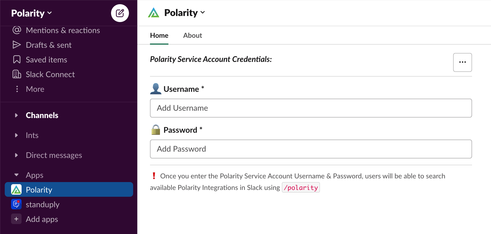

# Polarity Slack Command Setup Guide

## Config.js Setup
***1***. Go to the [./config/config.js](./config/config.js) file, and change the `slackCommandServer`'s `portNumber` & `polarityUrl`properties to your Polarity Server's information, making sure the `portNumber` you have set has been exposed from the polarity server.
    > ***NOTE***: Ensure your `polarityUrl` property does not end with `/` and it should start with `https://`

---

## Slack App Environment Token Setup
***2***. In the terminal from the root of the `./slack` integration folder (i.e. _not_ from the `./slack/slack-command` folder) run `npm run createEnvFile`

***3***. Set the `.env` variable `POLARITY_SLACK_APP_BOT_TOKEN` to your Slack App `Bot User OAuth Token` (_from the [Polarity App Installation Guide](./AddSlackAppToWorkspace.md) Step 12_)
    <div>
      
    </div>

***4***. Set the `.env` variable `POLARITY_SLACK_APP_SIGNING_SECRET` to your Slack App `Signing Secret` inside of the generated `./slack-command/.env` file.
    > ***NOTE***: The `npm run createEnvFile` script will open the file in `vi`, which can be closed by typing `:wq` then `Enter`.    
   <div>
      
    </div>

***5***. *[**OPTIONAL** *Skip Steps 6-8*]* 
For the `npm run updateAppManifest` command *OR* for local development and testing, it would also be beneficial to set your `POLARITY_SLACK_APP_TOKEN` & `POLARITY_SLACK_APP_REFRESH_TOKEN` as well, which can be found/generated at [https://api.slack.com/authentication/config-tokens](https://api.slack.com/authentication/config-tokens) by Authorized Slack App Collaborators in Slack.
   <div>
      
    </div>

   > ***NOTE***: It's a good idea to add anyone you want to have access to your Slack Application for configuration purposes as collaborators now.
   <div>
      
    </div>

---

## Slack App Manifest Updates
> ***NOTE***: *Steps 6-8* can be skipped if you have your  `POLARITY_SLACK_APP_TOKEN` & `POLARITY_SLACK_APP_REFRESH_TOKEN` `.env` variables set.
> 
> Instead of *Steps 6-8*  you can just run `npm run updateAppManifest` in the terminal from the same folder as *Step 2*. 
> 
> This will update the Slack App Manifest with all of the correct permission *scopes* and your *Polarity Server's FQDN* automatically.

***6***. Go to https://api.slack.com/apps/ and select the `Polarity` App

***7***. Navigate to the App Manifest Page, and Delete the contents of the YAML App Manifest
    <div>
      
    </div>

***8***. Paste in ***this*** App Manifest, ensuring to replace the 3 instances of `https://<polarity-server-fqdn>` with your servers information, then Click `Save Changes`:

```yaml
display_information:
  name: Polarity
  description: Polarity's Slack Application for use in tandem with our Polarity Slack Integration.
  background_color: "#53a13b"
features:
  app_home:
    home_tab_enabled: true
    messages_tab_enabled: false
    messages_tab_read_only_enabled: false
  bot_user:
    display_name: Polarity
    always_online: true
  slash_commands: 
    - command: /polarity
      url: https://<polarity-server-fqdn>/_slackcommand/command
      description: The Polarity command will return the results of a search to the Overlay
      usage_hint: Polarity Search Here
      should_escape: false
oauth_config:
  scopes:
    user:
      - search:read
    bot:
      - commands
      - channels:read
      - groups:read
      - im:read
      - mpim:read
      - chat:write
      - chat:write.customize
      - chat:write.public
      - users:read
      - users.profile:read

settings:
  event_subscriptions:
    request_url: https://<polarity-server-fqdn>/_slackcommand/events
    bot_events:
      - app_home_opened
  interactivity:
    is_enabled: true
    request_url: https://<polarity-server-fqdn>/_slackcommand/actions
  org_deploy_enabled: false
  socket_mode_enabled: false
  token_rotation_enabled: false
```

---

## Update Nginx
***9***. In the terminal run `npm run updateNginx`.
> ***NOTE***: If this command fails, you can do this step manually by adding the following to a new file you'll created called `slack-bot.conf` located at `/app/nginx/`, then running `systemctl restart nginx` from the terminal. Make sure to replace the `<port-number-from-config-js-file>` with the port number you set in the [./config/config.js](./config/config.js) file.
 ```
location /_slackcommand {
    proxy_set_header Host $host;
    proxy_set_header X-Real-IP $remote_addr;
    proxy_pass http://127.0.0.1:<port-number-from-config-js-file>
}
```
---

## Start Slack Command Server
***10***. In your terminal, navigate to the top level Slack Integration folder (`/app/polarity-server/integrations/slack`), and start the slack command server with the following command:
```bash
npm run startCommandServer
```
If the server is running correctly you will see the message `******* Slack Command Server Running *******` in your terminal.

Additionally, you can check the Slack command server log file `logs/slack-command-server.log` which should have the message `******* Slack Command Server Running on Port <your-port> *******` in it.

> ***NOTE***: If running for local development run `npm run startCommandServerDev` instead

---

## Add Polarity App to Slack
***11***. Add the Polarity App to your Slack Desktop or Browser App
    <div>
      
      
    </div>

***12***. Enter valid Polarity Credentials for the associated Polarity Service Account to the Slack App Home, Select which Integrations you wish to Include in your Search, and begin Searching!
> ***NOTE***: Only Slack Admins will be able to see & edit the  `Polarity Service Account Credentials` in the Slack App home.
    <div>
      
      
      
    </div>

